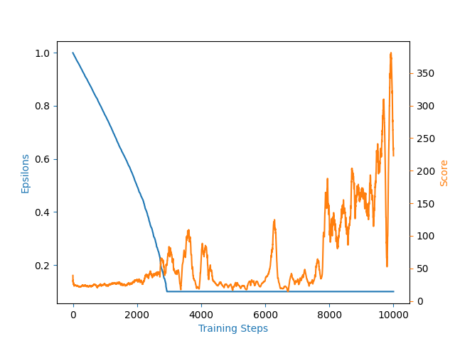

Title: Naive Deep Q Learning: Coding Deep Q Network with PyTorch
Date: 06-11-2021
Category: reinforcement learning, note
Tags: reinforcement learning
Slug: Naive Deep Q Learning
Authors: toohsk
Summary: Rough note of implementing deep q learning.

# Naive Deep Q Learning: Coding Deep Q Network

Implement Naive Deep Q Learning code, [here](https://github.com/toohsk/udemy-deep-q-learning-from-paper-to-code/tree/main/naive_deep_q_learning).
And the learning result was like in the figure.

As the result, after epsilon tends to minimum value, the agent starts to take actions and learn from it. But when you look closer to the score line, the wild fluctuations in the score became more and more severe after 6000 steps.
Why this happen?

## Reason of score’s fluctuations

1. Learning from a single example.
    The agent  sees many thousands of steps, and this experience is effectively discarded each time.
2. Epsilon value
    When epsilon is large, the agent could jump around in the highly dimensional space. But the epsilon slightly getting smaller, that makes the agent only look in the minimum local area.
3. Using the same network for evaluate and maximum action
    The agent is choosing the maximum action but it’ll be updated at every step. So the agent will chasing the moving target. The maximum action is role of bias, but getting optimal bias need a lot of cost.